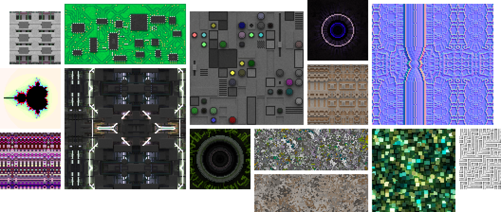

# Procedural Sandbox

[**Scratch**](https://scratch.mit.edu/projects/62182952)  |  [**TurboWarp**](https://turbowarp.org/62182952)  |  [**Wiki**](https://github.com/awesome-llama/procedural-sandbox/wiki)

A Scratch project designed to procedurally generate image textures. You could think of it as a combination of *[Image Editor](https://scratch.mit.edu/projects/552647396/)* and *[3D Terrain Generator](https://scratch.mit.edu/projects/600000129/)*.

This project intends on:

- Exploring ways to generate source textures for future Scratch games, especially 3D games like *[The Mast](https://scratch.mit.edu/projects/861541218/)*.
- Testing goboscript, which is a programming language that compiles to Scratch.
- Developing Python-based tools for generating data and editing projects.
- Further developing user interface handling for Scratch projects.
- Experimenting with exporting to different file formats such as [TextImage](https://github.com/awesome-llama/TextImage) and a way to download these files using [data URLs](https://developer.mozilla.org/en-US/docs/Web/URI/Reference/Schemes/data).
- Testing variations of the "main loop" and similar techniques seen in previous projects.
- Being an opportunity to learn path tracing.
- Exploring the feasibility of a programming language running in Scratch.

The project uses a 3D voxel "canvas" with each voxel storing red, green, blue, opacity, and emission data, in the range 0.0-1.0 (inclusive). The canvas wraps on the X and Y axes allowing for seamless texture generation. As this is mostly catered to 2D textures, most canvases will be considerably wider than they are tall.

TextImage is the supported image format for this project. Use the converter tool here: https://awesome-llama.github.io/utils/TextImage

## Dependencies

- [goboscript](https://github.com/aspizu/goboscript/) commit `1a1915f`, not release build
- Python 3.12

## Building

TL;DR: Run `build.bat`. If you are using VSCode, alternatively run the "Build (full)" task. The completed project file is `Procedural Sandbox.sb3`.

The build process could be seen as 3 parts: 

1. Generating list data with Python
2. Building the project with goboscript
3. .sb3 file post-processing with Python

A full build process would be as follows:

1. Run `src/data_URL/process.py` to generate the data URL list data.
2. Run `src/UI/UI_creator.py` to create the user interface list data.
3. Run the goboscript build command: `goboscript build -i src -o "Procedural Sandbox.sb3"`. An sb3 file will be generated.
4. Run `src/post-processing/main.py` to perform final clean up on the sb3 file. 
5. The sb3 file `Procedural Sandbox.sb3` can be opened up in Scratch or [TurboWarp](https://turbowarp.org/) (recommended).

This can be automated by running `build.bat` or the various VSCode tasks. You only need to generate the list data if it's the first time building or you've made a change to it. For this reason, the VSCode build task defaults to the other two parts.

## Contributing

Feel free to fork the repository and make pull requests. There are no specific contributing guidelines currently, it's an open-ended "do whatever you think would fit". If you are unsure whether a change would be accepted, consider asking.

Places where improvements could be seen include new texture generators (especially this!), path tracing, and more supported file formats.

Accepted code contributions will be credited in the project's built-in credits page (in settings) as well as in the Scratch "notes and credits" box.
